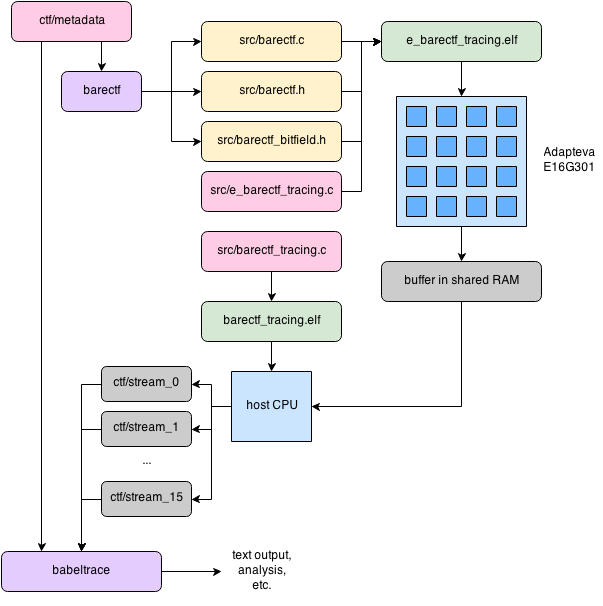

barectf tracing example
=======================

This example demonstrates how to use
[barectf](https://github.com/efficios/barectf) to generate C
source files used by the Epiphany cores to write
[CTF](http://www.efficios.com/ctf) natively.
CTF is a very flexible, fast to write binary trace format. Several
readers exist to view and analyze CTF traces
(e.g., [Babeltrace](http://www.efficios.com/babeltrace)).

This example currently only works for the Adapteva E16G301 chip.

A `babeltrace` text output (converted from the CTF binary trace
produced by Epiphany cores) is available in
[`doc/ctf-text-output.txt`](doc/ctf-text-output.txt).


details
-------

Here's the whole flow:




### what the host does

The host program (`src/barectf_tracing.c`) allocates 16 shared
buffers which will eventually contain plain CTF packets. It then
loads and launches the device program on all 16 cores. Once
the cores are done writing plain CTF, it reads back the 16 shared
buffers and writes them as is in 16 files named `stream_<id>`,
where `<id>` is the core ID, in the `ctf` directory. The `ctf`
directory contains a file named `metadata` which is used both by
barectf to generate C instrumentation functions as well as by CTF
readers to parse the binary streams accurately.


### what the Epiphany core does

All cores of the E16G301 are loaded with the same software. Once
started, the core configures interrupts and the eventual CTF clock
(using CTIMER1 which will count cycles).

The core then waits for all 16 cores to be at the same place in the
software using the `wand`/`idle` instructions. Since the local clock
is started right after that, all local clocks will increment equally,
so that CTF streams will be correlated very precisely.

Once the clock is started, the barectf context is initialized. The
buffer passed to `barectf_init()` is mapped to the core's local
memory. Thus, it should take the same amount of cycles to complete
all the initialization steps for all Epiphany cores.

The first event happens when `barectf_trace_init()` is called.
`barectf_trace_init()` is actually an instrumentation function
for the CTF event called `init`. All cores hit this instrumentation
point at the exact same time, which is why `babeltrace` shows the
exact same timestamp for the 16 first events:

```
[00:00:00.000007177] (+?.?????????) init: { row = 35, col = 9 }, { }
[00:00:00.000007177] (+0.000000000) init: { row = 34, col = 9 }, { }
[00:00:00.000007177] (+0.000000000) init: { row = 32, col = 8 }, { }
[00:00:00.000007177] (+0.000000000) init: { row = 33, col = 8 }, { }
[00:00:00.000007177] (+0.000000000) init: { row = 34, col = 10 }, { }
[00:00:00.000007177] (+0.000000000) init: { row = 32, col = 11 }, { }
[00:00:00.000007177] (+0.000000000) init: { row = 34, col = 8 }, { }
[00:00:00.000007177] (+0.000000000) init: { row = 33, col = 10 }, { }
[00:00:00.000007177] (+0.000000000) init: { row = 33, col = 11 }, { }
[00:00:00.000007177] (+0.000000000) init: { row = 32, col = 10 }, { }
[00:00:00.000007177] (+0.000000000) init: { row = 32, col = 9 }, { }
[00:00:00.000007177] (+0.000000000) init: { row = 35, col = 8 }, { }
[00:00:00.000007177] (+0.000000000) init: { row = 34, col = 11 }, { }
[00:00:00.000007177] (+0.000000000) init: { row = 35, col = 11 }, { }
[00:00:00.000007177] (+0.000000000) init: { row = 33, col = 9 }, { }
[00:00:00.000007177] (+0.000000000) init: { row = 35, col = 10 }, { }
...
```

`do_stuff()` is then called. This function has a loop of 32 iterations
busy-waiting for a time depending on the core's ID, and then tracing
one `epiphanious` event by calling `barectf_trace_epiphanious()`.
Epiphany cores with higher IDs should take more time to complete each
iteration, and ultimately, the last core ID (row 35, column 11 for the
E16G301) should be the last to finish. This is also confirmed by
`babeltrace`:

```
...
[00:00:00.002690434] (+0.000070272) epiphanious: { row = 35, col = 8 }, { sum = 496 }
[00:00:00.002691586] (+0.000001152) epiphanious: { row = 35, col = 9 }, { sum = 496 }
[00:00:00.002692738] (+0.000001152) epiphanious: { row = 35, col = 10 }, { sum = 496 }
[00:00:00.002693890] (+0.000001152) epiphanious: { row = 35, col = 11 }, { sum = 496 }
```
